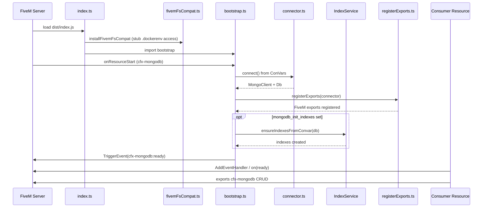
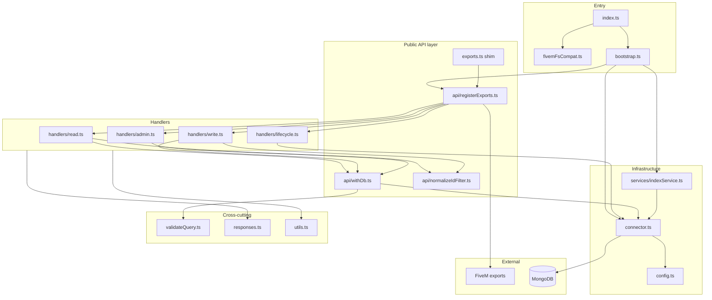

# Architecture — cfx-mongodb

## Zweck

Standalone FiveM-Server-Resource, die MongoDB für andere Ressourcen über **Exports** bereitstellt. Primärer Consumer: **CTFFramework** (Provider/Repository-Pattern über `exports["cfx-mongodb"]`).

## Laufzeit-Stack

```
FiveM Server (CitizenFX)
  └── Node 22 Runtime (fxmanifest: node_version '22')
        └── dist/index.js (CommonJS, Vite SSR build)
              └── mongodb@7 (external, nicht gebundelt)
                    └── MongoDB Server
```

### Warum Node 22 only?

FiveM/RedM liefern teils noch Node 16 oder 18. Diese Laufzeiten binden veraltete, sicherheitskritische Paketversionen. Ab **1.0.1** unterstützt cfx-mongodb **ausschließlich Node 22** — lokal (`engines`) und in der Resource (`node_version '22'`).

## Lebenszyklus

1. **Resource Start** (`src/index.ts` → `fivemFsCompat` then `src/bootstrap.ts`)
2. **Connect** (`MongoDBConnector.connect()` aus ConVars)
3. **Register Exports** (`registerExports()` in `bootstrap.ts` nach Connect)
4. **Optional:** Index-Init via `IndexService` aus `mongodb_init_indexes` ConVar
5. **Event:** `TriggerEvent("cfx-mongodb:ready")`
6. **Resource Stop** → `disconnect()`

Exports sind nach Connect registriert (`bootstrap.ts`).

### Lifecycle (Diagramm)



### Modulgraph (Diagramm)



**Leserichtung:** Consumer rufen nur `fivem` (Exports) auf. Handler nutzen `withDb` → `connector` → MongoDB. Optional: `withDb` misst Dauer und loggt Slow Queries (`mongodb_perf_enabled`). `index` lädt zuerst `fivemFsCompat` (MongoDB `.dockerenv` Probe vs FiveM FS-Sandbox), dann `bootstrap`. `exports.ts` ist nur ein Re-Export-Shim für stabile Imports.

## Schichten

| Schicht | Datei | Verantwortung |
|---------|-------|---------------|
| Entry | `index.ts` | Thin import: `fivemFsCompat` then bootstrap |
| FS compat | `fivemFsCompat.ts` | Stub `fs.promises.access` for `.dockerenv` probes |
| Bootstrap | `bootstrap.ts` | Lifecycle, export registration, index init |
| Connector | `connector.ts` | Singleton, MongoClient, Pool (`DbProvider`) |
| API wiring | `api/registerExports.ts` | Handler registration only |
| Handlers | `api/handlers/*.ts` | CRUD, admin, lifecycle exports |
| Pipeline | `api/withDb.ts` | Response envelope, error handling, slow-query timing |
| Perf | `perf.ts` | ConVar-gated slow query warnings |
| Index | `services/indexService.ts` | Shared index creation |
| Config | `config.ts` | ConVar → URI + Pool-Optionen |
| Validation | `validateQuery.ts` | Operator-Denylist |
| Types | `responses.ts`, `types/*` | Response-Contracts |
| Shim | `exports.ts` | Re-exports `registerExports` for stable import path |

## Build-Pipeline

```
src/**/*.ts  ──vite build (SSR, target node22)──►  dist/index.js
```

- MongoDB-Treiber bleibt **external** (FiveM lädt aus `node_modules`)
- Source Maps in `dist/index.js.map`

## Fehlerbehandlung (Design)

Alle async Exports fangen Fehler und geben `{ success: false, error: string }` zurück. Consumer (CTFFramework) haben kein try/catch um Export-Calls — **Exceptions würden den Caller crashen**.

## _id-Behandlung

Filter mit String-`_id` werden intern via `normalizeIdFilter()` / `toObjectIdIfValid()` in MongoDB `ObjectId` konvertiert. Rückgabe-Dokumente serialisieren `_id` als String.

## Erweiterungspunkte

- Neuer Export → passender `api/handlers/*.ts` + `registerExports.ts` + `fxmanifest.lua` + `docs/API.md`
- Neue ConVar → `config.ts` + `docs/API.md` Configuration
- Neue Validierung → `validateQuery.ts`
