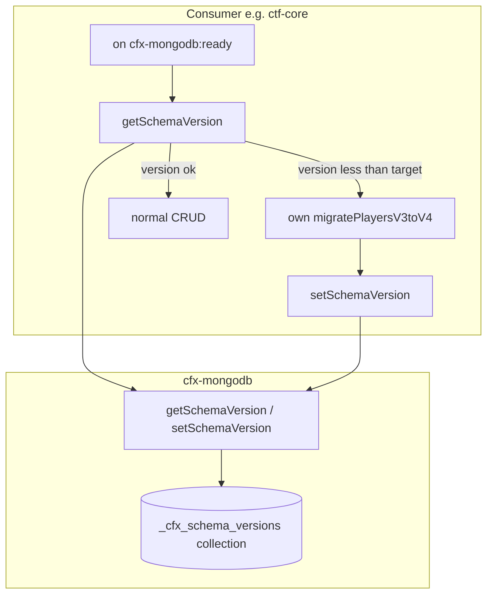

# Schema Versioning Plan — cfx-mongodb

> **Status:** Design only — **implement later if needed**  
> **Parent:** [MAINTENANCE-ROADMAP.md](MAINTENANCE-ROADMAP.md) Track D  
> **Decision:** Schema versioning (ledger + optional exports) — **not** full migration runner in core

## Problem

FiveM servers deploy consumer resources (e.g. CTFFramework) that evolve MongoDB document shapes over time. Today cfx-mongodb offers:

| Capability | Status |
|------------|--------|
| CRUD exports | ✅ |
| Index init (`ensureIndexes`, `mongodb_init_indexes`) | ✅ |
| **Which schema version is live for collection X?** | ❌ |
| **Idempotent “already migrated to v4”?** | ❌ — ad-hoc flags in app code |

**Schema versioning** answers: *“Resource `ctf-core`, scope `players` is at version 4.”*  
**Data migration logic** (backfill, rename fields) stays in the **consumer** — cfx-mongodb only provides a **shared ledger** and optional helpers.

---

## Goals & non-goals

### Goals

1. **Per-resource, per-scope version** — e.g. `("ctf-core", "players") → 4`
2. **Idempotent reads/writes** — safe on restart and duplicate `cfx-mongodb:ready` handlers
3. **Small core surface** — 2–3 exports, one reserved collection
4. **Compatible with CTFFramework** — envelope `{ success, error }`, never throw
5. **Works with existing lifecycle** — run checks after `cfx-mongodb:ready`, before CRUD

### Non-goals

1. **Automatic document transforms** in cfx-mongodb
2. **Migration file runner** (Flyway-style) in core — optional sibling resource later
3. **Cross-server migration orchestration** (sharding, blue/green)
4. **Schema validation** (JSON Schema on insert) — separate concern

---

## Conceptual model



| Term | Meaning | Example |
|------|---------|---------|
| **resource** | FiveM resource name (owner) | `ctf-core` |
| **scope** | Logical schema key within resource | `players`, `inventory`, `global` |
| **version** | Monotonic integer (consumer-defined steps) | `1`, `2`, `3` … |
| **Ledger** | MongoDB collection storing current version | `_cfx_schema_versions` |

**Why integer versions?** Migration steps map 1:1 (`if (v < 3) migrate2to3(); if (v < 4) migrate3to4()`). Semver of the **resource** (`getVersion()`) stays separate.

---

## Ledger document shape

**Collection:** `_cfx_schema_versions` (reserved prefix `_cfx_`)

```typescript
interface SchemaVersionDoc {
  _id: string;           // `${resource}:${scope}` — unique key
  resource: string;      // e.g. "ctf-core"
  scope: string;         // e.g. "players"
  version: number;       // current applied version
  updatedAt: string;     // ISO timestamp
  updatedBy?: string;      // optional server hostname / operator note
}
```

**Index (via `mongodb_init_indexes` or startup):**

```json
{
  "_cfx_schema_versions": [
    { "keys": { "_id": 1 } },
    { "keys": { "resource": 1, "scope": 1 }, "options": { "unique": true } }
  ]
}
```

---

## Proposed exports (Phase D1)

Category: **Erweitert** (like `ensureIndexes`) — trusted server resources only.

### `getSchemaVersion(resource, scope)`

```typescript
getSchemaVersion(
  resource: string,
  scope: string
): CfxMongoResult<number>;
```

- Missing ledger entry → `{ success: true, data: 0 }` (never migrated)
- Invalid args → `{ success: false, error: "..." }`

### `setSchemaVersion(resource, scope, version, meta?)`

```typescript
setSchemaVersion(
  resource: string,
  scope: string,
  version: number,
  meta?: { updatedBy?: string }
): CfxMongoResult<{ previous: number; current: number }>;
```

- Upsert by `_id = resource:scope`
- **Monotonic guard (optional ConVar):** reject `version < previous` unless `mongodb_schema_allow_downgrade 1`
- Default: only allow `version >= previous`

### `listSchemaVersions(resource?)` — Phase D1b (optional)

```typescript
listSchemaVersions(
  resource?: string
): CfxMongoResult<Array<{
  resource: string;
  scope: string;
  version: number;
  updatedAt: string;
}>>;
```

Admin/diagnostic — filter by resource if provided.

---

## Consumer pattern (recommended)

After `cfx-mongodb:ready`:

```typescript
const RESOURCE = "ctf-core";
const SCOPE = "players";
const TARGET = 4;

const mongo = exports["cfx-mongodb"];

async function ensurePlayersSchema() {
  const cur = await mongo.getSchemaVersion(RESOURCE, SCOPE);
  if (!cur.success) throw new Error(cur.error);

  let v = cur.data;

  if (v < 2) {
    await migratePlayersV1toV2();
    const r = await mongo.setSchemaVersion(RESOURCE, SCOPE, 2);
    if (!r.success) throw new Error(r.error);
    v = 2;
  }

  if (v < 4) {
    await migratePlayersV2toV4(); // can skip v3 if combined
    const r = await mongo.setSchemaVersion(RESOURCE, SCOPE, 4);
    if (!r.success) throw new Error(r.error);
  }
}
```

**Indexes:** bump schema version **after** successful migration; create indexes via existing `ensureIndexes` in same step or separately.

---

## Relation to existing features

| Feature | Schema versioning |
|---------|-------------------|
| `ensureIndexes` | Complementary — index for a schema step, version records “step done” |
| `mongodb_init_indexes` | Can include `_cfx_schema_versions` indexes at boot |
| `getVersion()` | Resource semver ≠ schema version |
| `cfx-mongodb:ready` | Hook point for `ensure*Schema()` before CRUD |
| Perf / `getQueryStats` | Unrelated |

---

## ConVars (draft)

| ConVar | Default | Description |
|--------|---------|-------------|
| `mongodb_schema_collection` | `_cfx_schema_versions` | Ledger collection name |
| `mongodb_schema_allow_downgrade` | `0` | Allow `setSchemaVersion` with lower version |

No ConVar required for D1 — sensible defaults only.

---

## Security

- Exports are **server-only** (already `server_only`)
- Document: only **trusted resources** call `setSchemaVersion` — no client input for `resource`/`scope` without validation
- Recommend: consumer uses **constant** `RESOURCE = GetCurrentResourceName()` and fixed scope strings
- Ledger contains **no document bodies** — metadata only

---

## Implementation phases

| Phase | Deliverable | Effort |
|-------|-------------|--------|
| **D1** | `getSchemaVersion`, `setSchemaVersion`, `schemaService.ts`, tests, `docs/API.md` | ~4–6 h |
| **D1b** | `listSchemaVersions`, monotonic guard ConVar | ~2 h |
| **D2** | `docs/examples/schema-versioning.md` + TS/Lua samples on `cfx-mongodb:ready` | ~2 h |
| **D3** | Types: `CfxMongoSchemaVersionResult` in `api.ts`; optional published `.d.ts` | overlaps Post-Track “TS for consumers” |
| **D4** | Sibling `cfx-mongodb-migrate` (file-based runner) | **deferred** — only if CTFFramework needs it |

**Start with D1 only** after explicit go-ahead (same pattern as Track C).

---

## Testing strategy

| Layer | Test |
|-------|------|
| Unit | `schemaService` — get missing → 0, set upsert, monotonic reject |
| Contract | New exports in `CFX_MONGODB_EXPORTS` + `fxmanifest.lua` |
| Integration | Manual on dev server — two restarts, version persists |

---

## Open questions (review before code)

1. **`resource` parameter:** explicit string vs auto `GetInvokingResource()` on set?  
   - **Recommendation:** explicit on both get/set — orchestrator resources can query others; document trust model.

2. **Collection name configurable?** ConVar vs fixed `_cfx_schema_versions`?  
   - **Recommendation:** ConVar with default; rarely changed.

3. **Include in CTFFramework required exports?**  
   - No — optional for consumers that need schema steps.

4. **Combine with index bumps in one “schema step” helper?**  
   - Keep separate — indexes via `ensureIndexes`, version via `setSchemaVersion`.

---

## Documentation deliverables (when implementing)

- `docs/API.md` — export signatures + examples
- `docs/GUIDE.md` — “Schema upgrades on deploy”
- `docs/examples/schema-versioning.ts` / `.lua`
- `docs/CHANGELOG.md`
- `SEARCH-MAP.md` — `src/services/schemaService.ts`

---

## Out of scope (explicit)

- Liquibase / Flyway port
- Automatic rollback (`down` migrations)
- Validation of document shape on CRUD
- Client-visible schema version

---

## Summary

**Schema versioning in cfx-mongodb = a small, shared version ledger** plus optional list export. Consumers own migration **logic**; the wrapper owns **persistence and conventions**. Fits the thin-wrapper philosophy and CTFFramework lifecycle better than a full migration engine in core.
